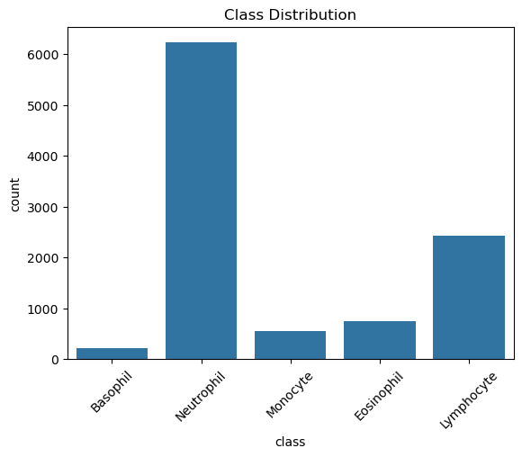
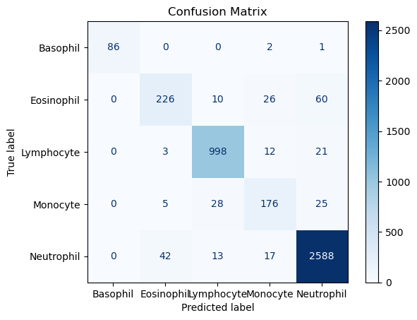
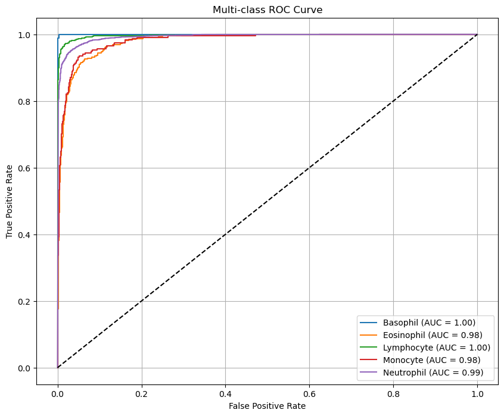
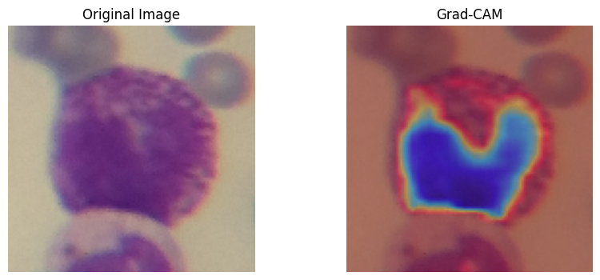

# 🧬 Leukocyte Classifier

A machine learning project for automated classification of leukocytes (white blood cells) using [insert method, e.g., deep learning or traditional ML] techniques. This tool aims to support hematological diagnostics by improving speed and accuracy in identifying cell types from microscopy images.


## 🧪 Features

- Preprocessing and normalization of leukocyte images  
- CNN-based architecture for classification (custom / transfer learning)  
- Evaluation metrics: accuracy, precision, recall, F1-score  
- Visualization of predictions and confusion matrix  
- Optionally: deployment via Streamlit or Flask

## 🧠 Model

The model was trained on Kaggle Dataset, with 5 classes:
- Neutrophils
- Eosinophils
- Basophils
- Lymphocytes
- Monocytes

Training achieved an accuracy of **XX%** on the validation set.

## 🚀 How to Use

1. Clone this repo:
   ```bash
   git clone https://github.com/yourusername/leukocyte-classifier.git
   cd leukocyte-classifier

### 📊 Class Distribution



The chart above illustrates the distribution of leukocyte classes...

### 🔍 Model Performance: Confusion Matrix



The confusion matrix above provides a detailed overview of the model's classification performance across the five leukocyte classes. Correct predictions are displayed along the diagonal, while off-diagonal values indicate misclassifications.

- **Neutrophils** and **lymphocytes** were classified with high accuracy, with 2,588 and 998 correct predictions respectively.
- **Basophils**, although a minority class, were mostly classified correctly (86), with minor confusion observed with monocytes and neutrophils.
- Misclassifications were more frequent between **eosinophils** and **neutrophils**, as well as between **monocytes** and **lymphocytes**, possibly due to morphological similarities.

This analysis emphasizes the need for handling class imbalance and improving class separability. Potential strategies include advanced augmentation techniques, class-specific tuning, or ensemble learning methods.

### 📈 Model Performance: AUC-ROC



the AUC-ROC curves here provided a detailed overview on the model classification performance on distinguishing classes
The model achieves the following AUC scores for each class:

- **Basophil**: 1.00
- **Lymphocyte**: 1.00
- **Neutrophil**: 0.99
- **Eosinophil**: 0.98
- **Monocyte**: 0.98


### 🧠 Model Explainability: Grad-CAM Visualization

To improve model interpretability and gain insights into decision-making processes, we employed **Grad-CAM (Gradient-weighted Class Activation Mapping)**. Grad-CAM provides a visual explanation by highlighting the regions of the input image that most influenced the model's prediction.

By computing the gradients of the target class score with respect to the final convolutional layer, Grad-CAM generates a **heatmap overlay** indicating spatial importance. This allows us to verify whether the model is focusing on biologically relevant areas, such as cytoplasmic granules, nuclear shape, or chromatin patterns, when classifying leukocytes.

Key benefits of using Grad-CAM in this project:

- ✅ Enhances transparency and trust in model predictions  
- 🔍 Helps detect potential misclassifications caused by irrelevant visual cues  
- 🧪 Supports clinical validation by aligning model focus with expert judgment  

These visualizations can be found in the `outputs/gradcam/` directory and are useful for both **qualitative evaluation** and **error analysis**.
as you can see in the example bellow

